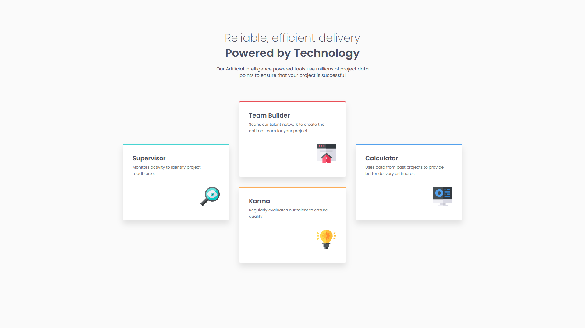

# Frontend Mentor - Four card feature section solution

This is a solution to the [Four card feature section challenge on Frontend Mentor](https://www.frontendmentor.io/challenges/four-card-feature-section-weK1eFYK).

## Table of contents

- [Overview](#overview)
  - [The challenge](#the-challenge)
  - [Screenshot](#screenshot)
  - [Links](#links)
- [My process](#my-process)
  - [Built with](#built-with)
  - [Continued development](#continued-development)
  - [Useful resources](#useful-resources)
- [Author](#author)

## Overview

### The challenge

Users should be able to:

- View the optimal layout for the site depending on their device's screen size

### Screenshot

### Links

- Solution URL: [GitHub](https://github.com/g-akca/four-card-feature-section)
- Live Site URL: [Four Card Feature Section](https://g-akca.github.io/four-card-feature-section/)

## My process

### Built with

- Semantic HTML5 markup
- CSS custom properties
- Flexbox
- CSS Grid
- Mobile-first workflow
- Media queries

### Continued development

I would like to do more research on how to decide between Flexbox and CSS Grid. Also, I want to do a better job on setting the top border of cards with border radius, because mine don't look exactly straight like the original designs.

### Useful resources

- [grid-template-areas - CSS | MDN](https://developer.mozilla.org/en-US/docs/Web/CSS/grid-template-areas) - Reminded me of the syntax when using grid-template-areas.

## Author

- GitHub - [@g-akca](https://github.com/g-akca)
- Frontend Mentor - [@g-akca](https://www.frontendmentor.io/profile/g-akca)
